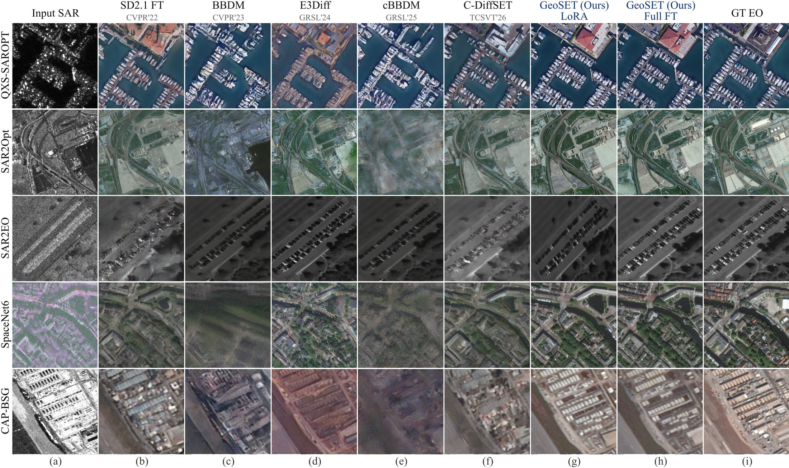
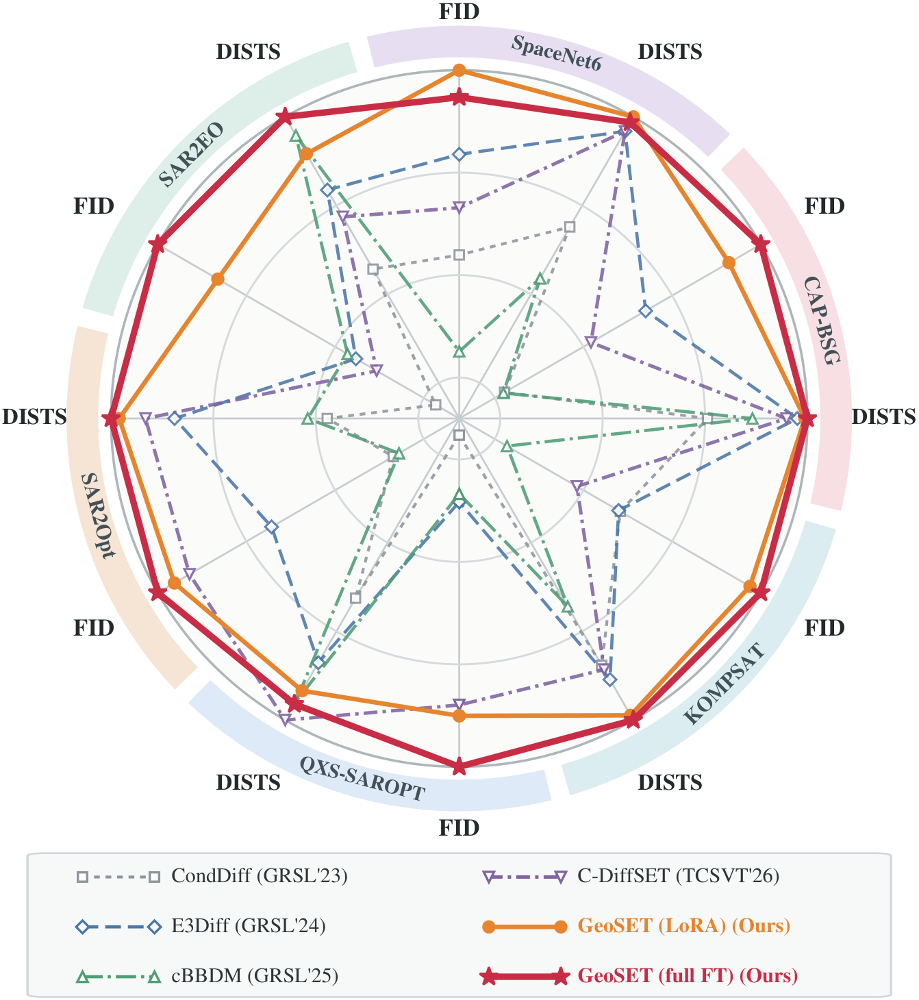
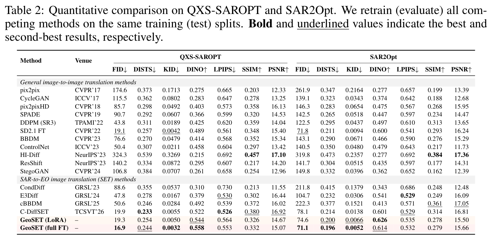
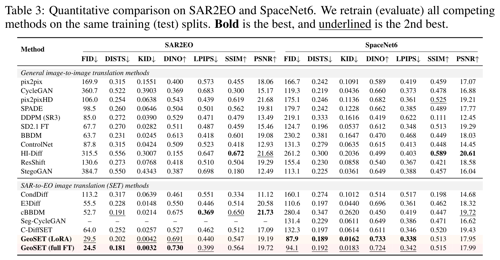
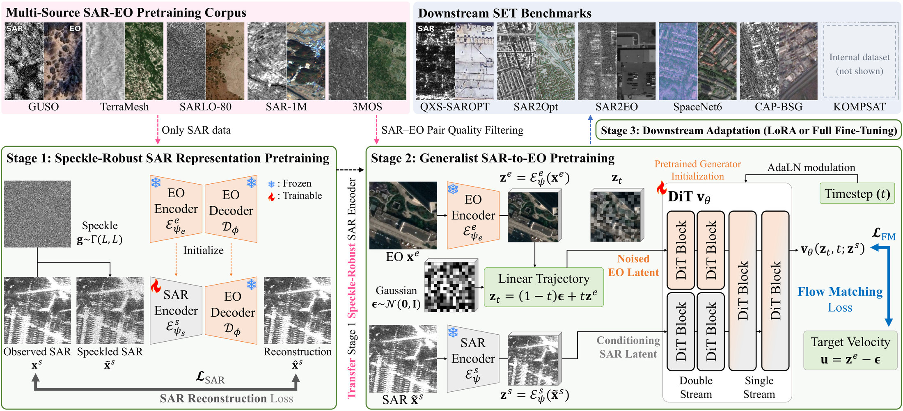

<p align="center">
  <picture>
    <source media="(prefers-color-scheme: dark)" srcset="assets/logo_dark.svg">
    
  </picture>
</p>

<div align="center">
<h2>GeoSET: Generalist Foundation Model for SAR-to-EO Image Translation</h2>

<div>
    <a href='https://jeonghyeokdo.github.io/' target='_blank'>Jeonghyeok Do</a>&nbsp;&nbsp;&nbsp;&nbsp;
    <a href='https://www.viclab.kaist.ac.kr/' target='_blank'>Munchurl Kim</a><sup>†</sup>
</div>
<div>
    Korea Advanced Institute of Science and Technology (KAIST), South Korea
</div>
<div>
    <sup>†</sup>Corresponding author
</div>

<div>
    <h4 align="center">
        <a href="https://kaist-viclab.github.io/GeoSET_site/" target='_blank'>
        
        </a>
        <!-- ARXIV_BADGE_START -->
        
        <!-- ARXIV_BADGE_END -->
        
    </h4>
</div>
</div>

---

<div align="center">
    <h4>
        This is the official repository of "GeoSET: Generalist Foundation Model for SAR-to-EO Image Translation".
    </h4>
</div>

## 📧 News
- **Sep 2026:** This repository is created. The code will be released soon.

## 📖 Abstract
Paired synthetic aperture radar (SAR) and electro-optical (EO) imagery is increasingly available across sensors, resolutions, and geographic regions. Yet existing SAR-to-EO image translation (SET) methods are typically trained on a single, limited-scale dataset, producing models specialized to particular sensing conditions. We introduce **GeoSET**, *the first generalist model for SET*, built around a single pretrained parent that is adapted to downstream datasets under a common protocol. We curate over 3 million high-quality SAR–EO pairs from a collection of more than 10 million SAR observations, spanning diverse sensors, spatial resolutions, and ground sampling distances. To bridge the modality gap between SAR observations and a pretrained image generator, we develop a speckle-robust SAR encoder and pretrain the conditional generator on this heterogeneous corpus. The resulting parent supports efficient adaptation across downstream datasets through low-rank adaptation (LoRA), updating only 0.60% of the generator parameters and requiring approximately one hour per dataset. Across six downstream benchmarks, GeoSET achieves state-of-the-art results in FID and DISTS with full fine-tuning or LoRA, demonstrating effective transfer across heterogeneous SAR–EO domains.

## 📊 Results
Across full fine-tuning and LoRA, GeoSET achieves the best reported FID on all six downstream benchmarks and the best DISTS on five.

### Qualitative Comparison
Columns (g)–(h): GeoSET with LoRA and full fine-tuning; (i): ground-truth EO.

<div align="center">
    
</div>

### Cross-Dataset Comparison
FID and DISTS on six benchmarks, normalized for each dataset–metric pair as 100 × best / value (outer ring = best).

<div align="center">
    
</div>

### Quantitative Comparison
All competing methods are retrained and evaluated on the same splits. FID and DISTS are the primary metrics; LPIPS, PSNR and SSIM are retained as complementary fidelity measures.

<div align="center">
    
</div>
<br>
<div align="center">
    
</div>

**Please visit our [project page](https://kaist-viclab.github.io/GeoSET_site/) for the interactive gallery and more results.**

## 🖼️ Method Overview

<div align="center">
    
</div>

- **Stage 1 · Speckle-robust SAR encoder:** reconstructs the original SAR observation from a speckle-perturbed copy through a frozen decoder.
- **Stage 2 · Generalist pretraining:** a SAR-conditioned FLUX.2 flow transformer is trained on 3,204,744 curated SAR–EO pairs.
- **Stage 3 · Downstream adaptation:** the same parent is adapted to each benchmark by LoRA (0.60% of generator parameters, about one hour per dataset) or full fine-tuning.

## 🚀 Code Release Plan
**The code and pretrained models will be released soon.**

- [ ] Inference code
- [ ] Pretrained models
- [ ] Training scripts
- [ ] Evaluation scripts

## 📑 Citation
If you find GeoSET useful, please consider citing:
```BibTeX
@article{do2026geoset,
  title={GeoSET: Generalist Foundation Model for SAR-to-EO Image Translation},
  author={Do, Jeonghyeok and Kim, Munchurl},
  journal={arXiv preprint arXiv:XXXX.XXXXX},
  year={2026}
}
```

Our prior work on SAR-to-EO image translation, [C-DiffSET](https://github.com/KAIST-VICLab/C-DiffSET) ([project page](https://kaist-viclab.github.io/C-DiffSET_site/)):
```BibTeX
@article{do2026cdiffset,
  title={C-DiffSET: Leveraging Latent Diffusion for SAR-to-EO Image Translation with Confidence-Guided Reliable Object Generation},
  author={Do, Jeonghyeok and Lee, Jaehyup and Lee, Seungchul and Kim, Munchurl},
  journal={IEEE Transactions on Circuits and Systems for Video Technology},
  year={2026},
  doi={10.1109/TCSVT.2026.3701447}
}
```
